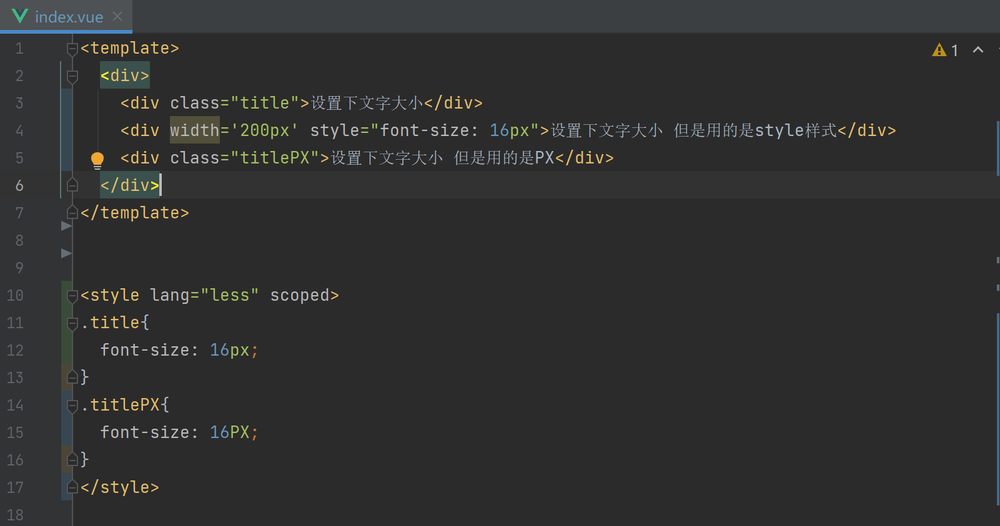
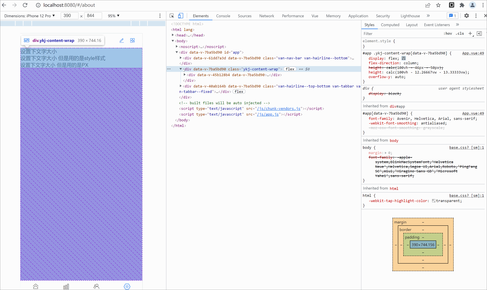

# postcss-style-px-to-viewport
自实现一个webpack loader 将vue模板中行内样式的px单位转为vw单位

主要是弥补postcss-px-to-viewport对行内样式的不足

### install

```npm
npm install postcss-style-px-to-viewport --save-dev
or
yarn add postcss-style-px-to-viewport -D
```

### Use

vue-cli3

```javascript
{
  chainWebpack: (config) => {
      config.module
      .rule('vue')
      .test(/\.vue$/)
      .use('style-vw-loader')
        .loader('style-vw-loader')
    }
}
```

vue-cli2

```text
{
    test: /\.(vue|jsx?)$/,
    loader: 'style-vw-loader',
    options: {
       
    }
}
```

### Example

原HTML代码
```html
<div width="200px" style="font-size: 16px;">设置下文字大小 但是用的是style样式</div>
```
loader转换后
```html
<div width="53.33333vw" style="font-size: 4.26667vw;">设置下文字大小 但是用的是style样式</div>
```

### 效果



### option
默认配置
```javascript
defaultsProp = {
  unitToConvert: 'px',
  viewportWidth: 750,
  unitPrecision: 5,
  viewportUnit: 'vw',
  fontViewportUnit: 'vw',
  minPixelValue: 1
}
```

### 参与

目前值匹配了vue项目，对于其他项目与问题欢迎完善与共建
